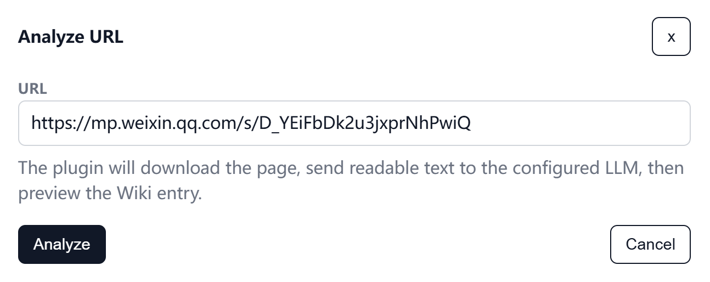
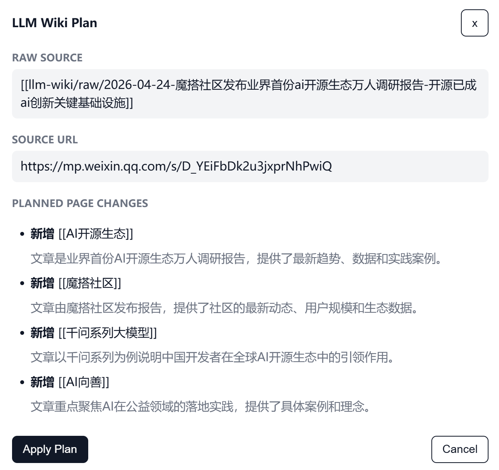
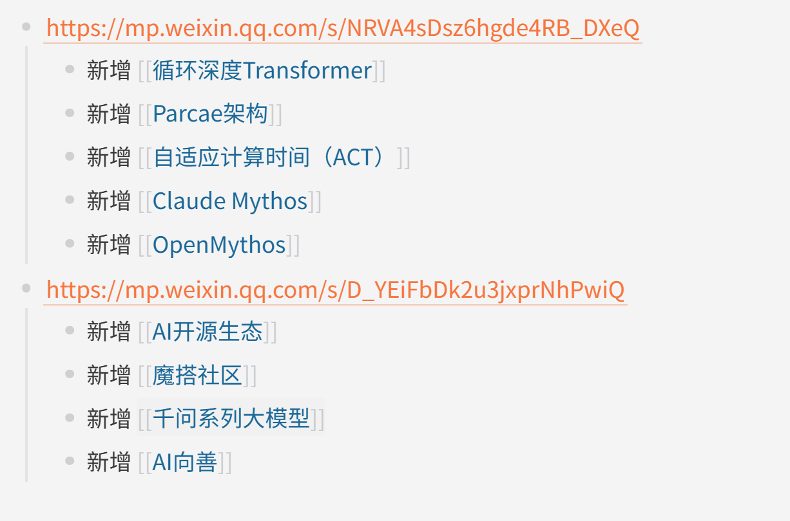
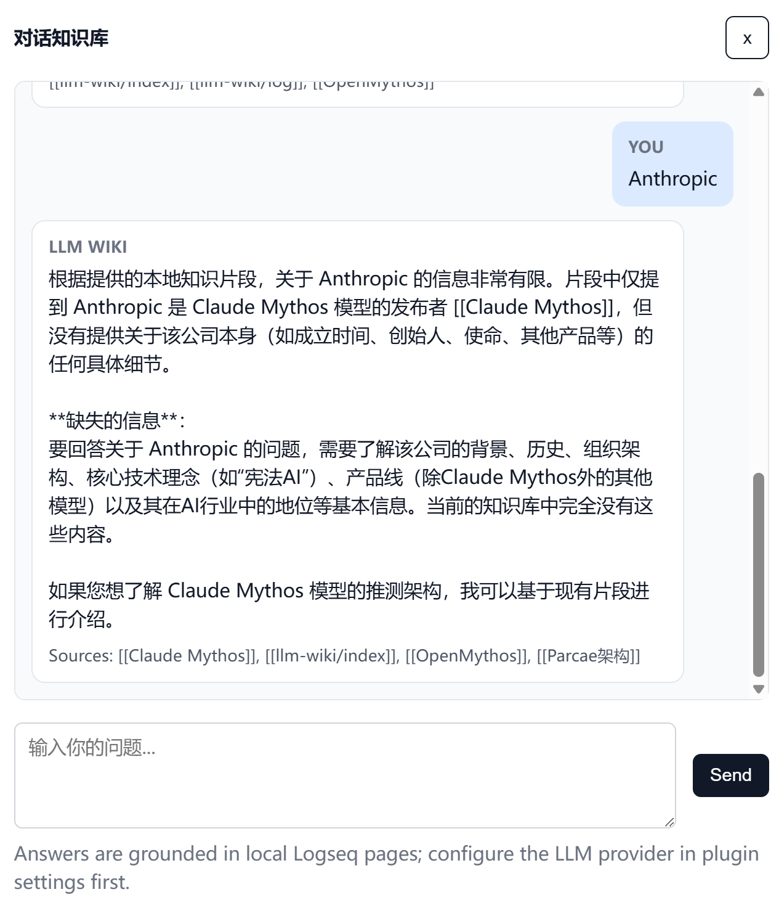

# llm_wiki_for_logseq

[中文说明](./README.md)

An experimental LLM Wiki project built on top of Logseq.

This repository contains three parts:

- `pages/` and `journals/`: the Logseq graph content
- `plugins/llm-wiki/`: the Logseq plugin source code for compiling notes into a linked wiki workflow
- GitHub Pages static site generation config for publishing the graph as a browsable website

The current sample content focuses on the Soviet Navy, including fleets, people, branches, and source pages.

## Plugin Screenshots









## Project Layout

```text
.
├─ pages/                  Logseq pages
├─ journals/               Logseq journals
├─ logseq/                 Local Logseq config
├─ plugins/llm-wiki/       Logseq plugin source
├─ template/               GitHub Pages templates
├─ assets/                 Static site assets
├─ gen.rb                  Site generation entrypoint
└─ logseq.toml             Site generation config
```

## Local Development

### 1. Develop the Logseq plugin

From the plugin directory:

```bash
cd plugins/llm-wiki
npm install
npm run dev
```

Available commands:

```bash
npm run build
npm run test
npm run lint
```

### 2. Generate the static site locally

From the repository root:

```bash
bundle install
bundle exec ruby gen.rb
```

The generated site is written to:

```text
site/
```

## GitHub Pages

The repository includes a GitHub Actions workflow:

```text
.github/workflows/gh-pages.yml
```

On updates to `main`, the workflow will:

1. install Ruby dependencies
2. run `bundle exec ruby gen.rb`
3. publish the generated output to the `gh-pages` branch

When enabling Pages for the first time, make sure:

- `Settings` -> `Actions` -> `General` allows workflow write permissions
- `Settings` -> `Pages` is enabled for the repository

## Notes

- `site/` is generated output and is not committed
- `plugins/llm-wiki/dist/` and `node_modules/` are ignored
- the current templates are intentionally lightweight and optimized for stable Logseq content rendering

## License

MIT
